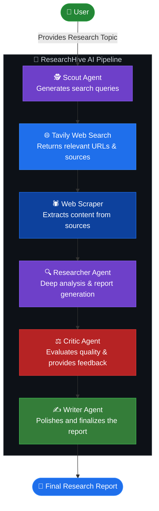
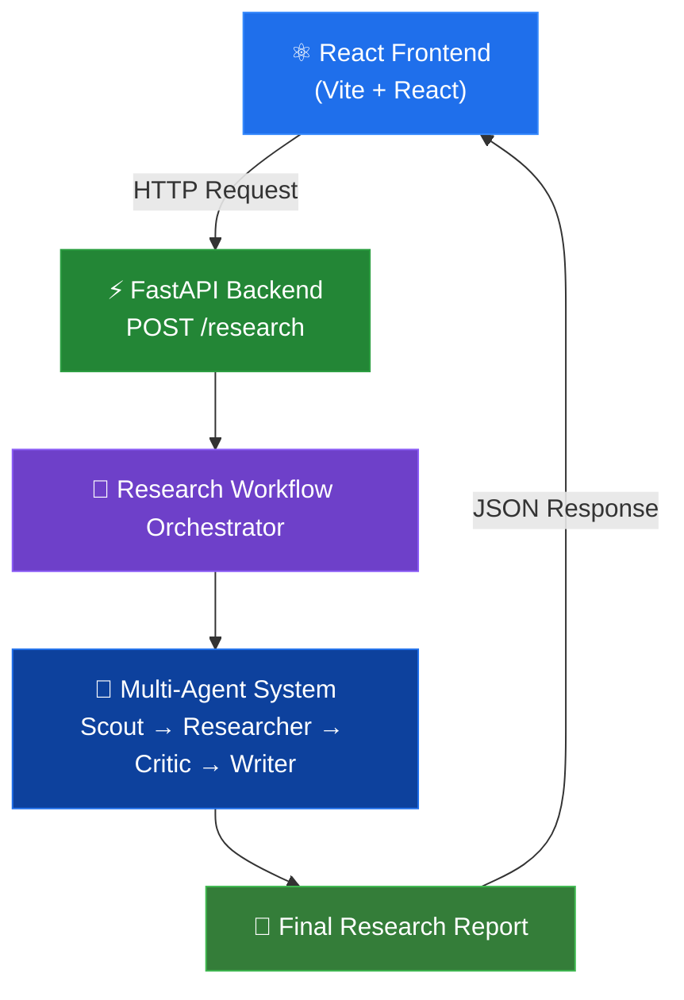

<div align="center">

<h1>🔬 ResearchHive AI</h1>
<h3>A Multi-Agent AI Research System</h3>

<p>
  
  
  
  
  
  
  
  
</p>

<p><em>An intelligent, multi-agent research pipeline that scouts the web, analyzes sources, critiques findings, and delivers polished research reports — fully automated.</em></p>

</div>

---

## 📑 Table of Contents

- [Overview](#-overview)
- [System Workflow](#-system-workflow)
- [AI Agents](#-ai-agents)
- [Technology Stack](#-technology-stack)
- [Architecture](#-architecture)
- [Features](#-features)
- [Project Structure](#-project-structure)
- [Installation](#-installation)
- [Running the Application](#-running-the-application)
- [API Documentation](#-api-documentation)
- [Future Improvements](#-future-improvements)
- [Contributing](#-contributing)
- [License](#-license)

---

## 🧠 Overview

**ResearchHive AI** is an AI-powered multi-agent research system that automates the entire research process — from generating intelligent search queries to delivering a final, polished research report.

The system orchestrates a pipeline of specialized AI agents that collaborate sequentially. Each agent has a clearly defined role: scouting the web, scraping content, conducting deep analysis, critiquing quality, and writing the final output. This architecture ensures thorough, high-quality research on any topic provided by the user.

Built with **Python**, **LangChain**, **FastAPI**, **Groq LLM**, **Tavily Search API**, and a **React + Vite** frontend.

---

## 🔄 System Workflow

The following diagram illustrates the complete end-to-end research pipeline:



---

## 🤖 AI Agents

Each agent in the pipeline is specialized for a distinct research task:

| # | Agent | Icon | Responsibility |
|---|-------|------|----------------|
| 1 | **Scout Agent** | 🕵️ | Receives the user's research topic and generates multiple intelligent, focused search queries to maximize coverage |
| 2 | **Tavily Search** | 🌐 | Executes the generated queries against the live web and returns relevant sources, URLs, and metadata |
| 3 | **Web Scraper** | 🕷️ | Visits discovered URLs and extracts meaningful content — including titles, body text, and source URLs |
| 4 | **Researcher Agent** | 🔍 | Analyzes all collected documents to identify key information, trends, patterns, and insights; produces a detailed research report |
| 5 | **Critic Agent** | ⚖️ | Reviews the research report and evaluates it for strengths, weaknesses, missing information, unsupported claims, contradictions, and recommendations; assigns an overall quality score |
| 6 | **Writer Agent** | ✍️ | Takes the research report and the critic's feedback and produces a final, polished, professionally structured research report |

---

## 🛠️ Technology Stack

| Layer | Technology | Purpose |
|-------|-----------|---------|
| **Language** | Python 3.10+ | Core backend language |
| **AI Framework** | LangChain | Agent orchestration and LLM chaining |
| **LLM Provider** | Groq | Fast inference for all AI agents |
| **Web Search** | Tavily Search API | Real-time web search for research queries |
| **Web Scraping** | Python (requests / BeautifulSoup) | Content extraction from web sources |
| **API Framework** | FastAPI | REST API backend |
| **Schema Validation** | Pydantic | Request/response data validation |
| **ASGI Server** | Uvicorn | FastAPI application server |
| **Frontend** | React 19 + Vite | Interactive user interface |

---

## 🏗️ Architecture

ResearchHive AI follows a clean, layered architecture:



### API Endpoint

```
POST /research
```

**Request Body:**

```json
{
  "topic": "Impact of Artificial Intelligence on the IT Job Market"
}
```

The FastAPI backend receives the topic, runs it through the complete multi-agent research pipeline, and returns the final structured result.

---

## ✨ Features

- 🤖 **Multi-Agent AI Architecture** — Specialized agents collaborating in a coordinated pipeline
- 🔎 **Intelligent Query Generation** — Scout Agent creates optimized search queries for maximum research coverage
- 🌐 **Real-Time Web Search** — Powered by Tavily Search API for live, relevant web results
- 🕷️ **Automated Web Scraping** — Extracts and cleans content from discovered web sources
- 🔬 **Deep Research & Analysis** — Researcher Agent synthesizes information into structured reports
- ⚖️ **Research Quality Evaluation** — Critic Agent scores and reviews reports for accuracy and completeness
- 📝 **Structured Critic Feedback** — Identifies strengths, weaknesses, gaps, and provides recommendations
- ✍️ **AI-Polished Final Reports** — Writer Agent refines raw research into professional, readable output
- ⚡ **FastAPI REST API** — Clean, documented API backend with async support
- ⚛️ **React Frontend Integration** — Modern, responsive user interface built with React and Vite
- 📐 **Structured Research Workflow** — Every research task follows a consistent, reproducible pipeline

---

## 📁 Project Structure

```text
ResearchHive-AI/
│
├── app/                          # Core application package
│   │
│   ├── agents/                   # AI Agent modules
│   │   ├── scout.py              # Scout Agent — query generation
│   │   ├── researcher.py         # Researcher Agent — deep analysis
│   │   ├── critic.py             # Critic Agent — quality evaluation
│   │   └── writer.py             # Writer Agent — report polishing
│   │
│   ├── prompts/                  # LLM prompt templates
│   │   ├── scout_prompt.py
│   │   ├── researcher_prompt.py
│   │   ├── critic_prompt.py
│   │   └── writer_prompt.py
│   │
│   ├── tools/                    # External tool integrations
│   │   └── tavily_search.py      # Tavily Search API + Web Scraper
│   │
│   ├── services/                 # Business logic layer
│   │   └── research_pipeline.py  # Pipeline execution service
│   │
│   ├── schemas/                  # Pydantic request/response schemas
│   │
│   ├── orchestrator/             # Workflow coordination
│   │   └── workflow.py           # Multi-agent orchestration logic
│   │
│   └── config.py                 # App configuration and settings
│
├── frontend/                     # React + Vite frontend application
│   ├── src/
│   │   ├── components/           # React UI components
│   │   └── App.jsx               # Root application component
│   ├── package.json
│   └── vite.config.js
│
├── main.py                       # FastAPI app entry point
├── requirements.txt              # Python dependencies
├── .env.example                  # Example environment variables
├── .gitignore
└── README.md
```

---

## ⚙️ Installation

Follow these steps to set up ResearchHive AI on your local machine.

### Prerequisites

- Python 3.10 or higher
- Node.js 18 or higher
- A [Groq API Key](https://console.groq.com/)
- A [Tavily API Key](https://app.tavily.com/)

---

### 1. Clone the Repository

```bash
git clone https://github.com/your-username/ResearchHive-AI.git
```

### 2. Navigate to the Project Directory

```bash
cd ResearchHive-AI
```

### 3. Create a Python Virtual Environment

```bash
python -m venv venv
```

### 4. Activate the Virtual Environment

**Windows:**

```bash
venv\Scripts\activate
```

**macOS / Linux:**

```bash
source venv/bin/activate
```

### 5. Install Python Dependencies

```bash
pip install -r requirements.txt
```

### 6. Create the Environment Variables File

```bash
copy .env.example .env
```

### 7. Add Your API Keys

Open the `.env` file and add your API keys:

```env
GROQ_API_KEY=your_groq_api_key_here
TAVILY_API_KEY=your_tavily_api_key_here
```

> ⚠️ **Never commit your `.env` file to version control.** It is already included in `.gitignore`.

---

## 🚀 Running the Application

### Run the FastAPI Backend

```bash
uvicorn main:app --reload
```

The backend will start at:

```
http://127.0.0.1:8000
```

Interactive API documentation is available at:

```
http://127.0.0.1:8000/docs
```

---

### Run the React Frontend

Open a new terminal, then:

```bash
cd frontend
npm install
npm run dev
```

The frontend will start at:

```
http://localhost:5173
```

---

## 📖 API Documentation

### `POST /research`

Initiates the multi-agent research pipeline for the given topic.

#### Request

```http
POST /research
Content-Type: application/json
```

```json
{
  "topic": "Your research topic here"
}
```

| Field | Type | Required | Description |
|-------|------|----------|-------------|
| `topic` | `string` | ✅ Yes | The research topic to investigate |

#### Response

```json
{
  "topic": "Impact of Artificial Intelligence on the IT Job Market",
  "search_queries": [
    "AI impact on IT jobs 2024",
    "artificial intelligence replacing software engineers",
    "future of IT careers with AI automation"
  ],
  "research": "Detailed research report generated by the Researcher Agent...",
  "critic_feedback": {
    "overall_score": 8,
    "strengths": [
      "Comprehensive coverage of current AI trends",
      "Well-supported claims with multiple sources"
    ],
    "weaknesses": [
      "Limited discussion of long-term projections"
    ],
    "missing_information": [
      "Regional impact differences across emerging markets"
    ],
    "unsupported_claims": [],
    "contradictions": [],
    "recommendations": [
      "Include more data from industry surveys",
      "Add perspectives from IT professionals"
    ]
  },
  "final_report": "Final polished and professionally written research report..."
}
```

| Field | Type | Description |
|-------|------|-------------|
| `topic` | `string` | The original research topic |
| `search_queries` | `array` | Queries generated by the Scout Agent |
| `research` | `string` | Raw research report from the Researcher Agent |
| `critic_feedback` | `object` | Structured evaluation from the Critic Agent |
| `critic_feedback.overall_score` | `integer` | Research quality score (1–10) |
| `final_report` | `string` | Final polished report from the Writer Agent |

---

## 🔮 Future Improvements

The following enhancements are planned for future versions:

| Category | Improvement |
|----------|------------|
| 🔴 **Real-Time** | WebSocket support for live agent progress tracking |
| 🔴 **Real-Time** | Real-time streaming of research stages to the frontend |
| 🗄️ **Data** | Database integration for research history and persistence |
| 🗄️ **Data** | User authentication and personal research libraries |
| 📤 **Export** | Download reports as PDF |
| 📤 **Export** | Export reports as Markdown files |
| 📚 **Quality** | Improved source citation and reference management |
| 🔁 **Reliability** | Agent feedback loops for iterative research refinement |
| 🔁 **Reliability** | Retry mechanisms and enhanced error handling |
| 🐳 **Deployment** | Dockerized deployment for easy self-hosting |
| ☁️ **Deployment** | Cloud deployment support (AWS, GCP, Azure) |

---

## 🤝 Contributing

Contributions are welcome! To contribute:

1. **Fork** the repository
2. **Create** a new feature branch:
   ```bash
   git checkout -b feature/your-feature-name
   ```
3. **Commit** your changes with a descriptive message:
   ```bash
   git commit -m "feat: add your feature description"
   ```
4. **Push** to your branch:
   ```bash
   git push origin feature/your-feature-name
   ```
5. **Open a Pull Request** on GitHub and describe your changes

Please ensure your code follows existing conventions and is well-documented before submitting a pull request.

---

## 📄 License

This project is licensed under the **MIT License**.

```
MIT License

Copyright (c) 2026 ResearchHive AI

Permission is hereby granted, free of charge, to any person obtaining a copy
of this software and associated documentation files (the "Software"), to deal
in the Software without restriction, including without limitation the rights
to use, copy, modify, merge, publish, distribute, sublicense, and/or sell
copies of the Software, and to permit persons to whom the Software is
furnished to do so, subject to the following conditions:

The above copyright notice and this permission notice shall be included in all
copies or substantial portions of the Software.

THE SOFTWARE IS PROVIDED "AS IS", WITHOUT WARRANTY OF ANY KIND, EXPRESS OR
IMPLIED, INCLUDING BUT NOT LIMITED TO THE WARRANTIES OF MERCHANTABILITY,
FITNESS FOR A PARTICULAR PURPOSE AND NONINFRINGEMENT. IN NO EVENT SHALL THE
AUTHORS OR COPYRIGHT HOLDERS BE LIABLE FOR ANY CLAIM, DAMAGES OR OTHER
LIABILITY, WHETHER IN AN ACTION OF CONTRACT, TORT OR OTHERWISE, ARISING FROM,
OUT OF OR IN CONNECTION WITH THE SOFTWARE OR THE USE OR OTHER DEALINGS IN THE
SOFTWARE.
```

---

<div align="center">

**Built with 🔬 intelligence and ❤️ passion**

*ResearchHive AI — Research smarter, not harder.*

</div>
